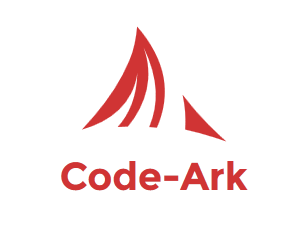

# Documentation

## _**Features**_
* Pretty URLs
* PSR-1 Coding standards 
* Autoload Classes

## **Configure** 
To have the public folder as the web root we need to configure the web server so the root is not the current root, but is
the public folder.
Go to Apache configuration, and find "Localhost VirtualHost" settings, and change the DocumentRoot directive.

or use the .htaccess file just change the __"RewriteBase /Your-project/"__ to your project directory name.

## **Pretty or Vanity URLs**
 To get pretty url just change the __"RewriteBase /sand_box/code_ark/"__ of .htaccess in public folder to your root directory.
 
## **Controller and Action**
Words separated in the URL by __hyphens__.   
Controller classes are named using __StudlyCaps__ (PSR-1 coding standard) 
Action methods are named using __camelCase__  
__******************************************************************************__  
Add a suffix to the method name, we need specify that any actions added to controllers will need to have this suffix    
<pre><code>
class Posts 
{ 
    public function indexAction() 
    { 
        // show all posts 
    } 
    public function showAction() 
    { 
            // show all posts 
    } 
}
</code></pre>

if we return false from the __before__ method from the implemented class, it won't execute the originally called method
 and this is useful for example for checking to see if the user had logged in or had the correct permission. It's very useful for things like authentication. 
