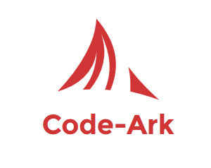

# Code Ark

This is a simple yet powerful PHP MVC Based Framework. i have attached a full documentation file, please find the attached document for your reference.
I have listed the features of this framework downwards: 
## _**Features**_
* Pretty URLs
* PSR-1 Coding standards 
* Autoload Classes
* Action Filters
* Added Twig template and Twig rendered views 
* PDO Database connection
* Exception Handler and Error Handler
* Error Log
* Development and Production Mode
* HTTP status code based Error
* Custom 404 and 500 error message display page for production level 

---

Please visit my Blog [Code-Architect](../blob/master/LICENSE) for more information or to contact me.
Every kind of suggestions are welcome, and if you find a bug or an error please inform me.You can contribute to make this 
Framework better.

contact me get@codearchitect.in
